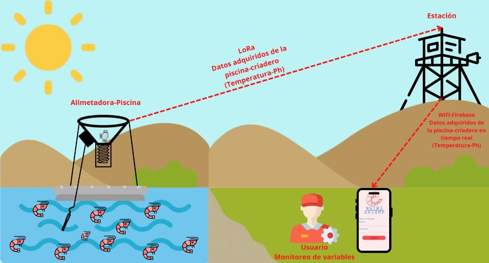
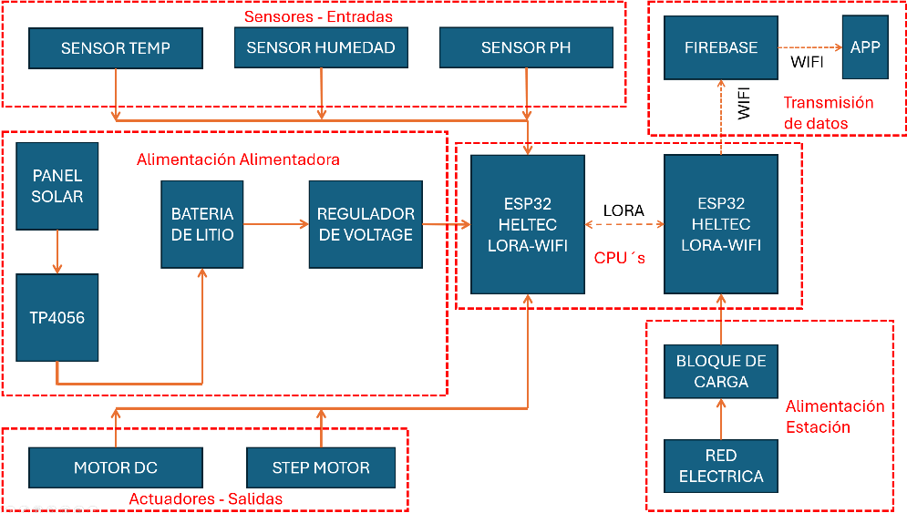
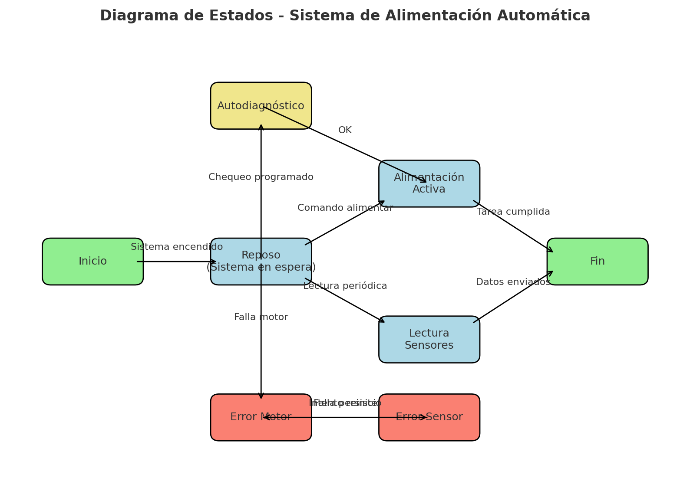
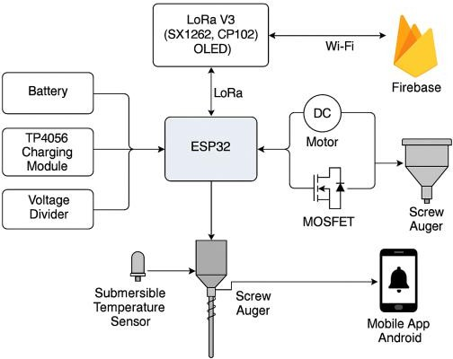

# Proyecto de Alimentación Automática en Acuicultura

## Introducción
La distribución automática de alimentos del camarón en estanques acuícolas busca diseñar y construir una tolva alimentadora automática. 
El sistema cuenta con un tornillo sinfín y un motor de corriente continua, el cual dosifica la comida en la medida requerida, entregando un suministro preciso. 

El sistema es capaz de activar el tornillo con control local vía LoRa, mientras que el monitoreo se realiza de forma remota a través de una aplicación móvil en Android Studio que se conecta a Firebase. Esto permite mostrar el estado del sistema y sensores, batería, además de permitir el envío de comandos.

En los sistemas acuícolas tradicionales, la alimentación manual representa hasta el **60 % de los costos de operación**. Además, el exceso de alimento no consumido genera un **impacto ambiental negativo**, pues se acumula en el fondo de los estanques, deteriora la calidad del agua y aumenta la mortalidad de los organismos. Con la automatización se busca **reducir el desperdicio**, **optimizar la eficiencia productiva** y **minimizar los costos asociados**, lo que justifica el desarrollo de este sistema.

---

## Alcance y Limitaciones

### Alcance
- Desarrollo de un sistema dosificador automático basado en ESP32 con conectividad LoRa y Wi-Fi.  
- Control del motor mediante un circuito con MOSFET para ahorro energético.  
- Incorporación de sensores para temperatura y nivel de alimento.  
- Recepción de comandos mediante nodo transmisor LoRa.  
- Supervisión en tiempo real mediante Firebase.  
- Desarrollo de una aplicación móvil Android.  

### Limitaciones
- El rango máximo de LoRa se reduce con obstáculos o interferencias.  
- La autonomía depende de la batería Li-Ion, que requiere recarga periódica.  
- La aplicación móvil depende de internet para sincronizar datos con Firebase.  
- El sistema aún no cuenta con autodiagnóstico de fallos en sensores o motor.  

---

## Diagramas

### 1. Diagrama de contexto

### 2. Diagrama de bloques

### 3. Diagrama de estados

### 4. Diagrama de interfaces

---

## Alternativas de Diseño

| Elemento                  | Opciones                     | Solución elegida       | Justificación                                  |
|----------------------------|------------------------------|------------------------|-----------------------------------------------|
| Comunicación entre módulos | Wi-Fi, Bluetooth, LoRa      | LoRa                   | Mayor alcance y bajo consumo energético        |
| Comunicación remota        | HTTP, MQTT, Firebase        | Firebase               | Comunicación en tiempo real y fácil integración con Android |
| Control del motor          | Relé, Puente H, MOSFET      | MOSFET IRLZ44N         | Eficiente para un solo sentido de giro         |
| Sensor de nivel            | Celda de carga, capacitivo, ultrasónico | Sensor capacitivo | Económico y fácil de implementar              |
| Suministro energético      | Red eléctrica, batería      | Batería Li-Ion         | Autonomía y portabilidad                      |
| App móvil                  | WebApp, nativa              | Firebase + Android Studio | Aprovecha conocimientos previos             |
| Carga de batería           | Cargador externo, TP4056    | TP4056                 | Solución simple y económica                   |

---

## Plan de Pruebas y Validación

- **LoRa**: Evaluación de rango, latencia, errores y respuesta ante datos faltantes.  
- **Motor**: Verificación de la dosis entregada y consistencia durante la carga.  
- **Sensores**: Validación contra equipos calibrados y control del nivel de alimento.  
- **Aplicación móvil**: Sincronización con Firebase, comandos, notificaciones y visualización de datos.  
- **Energía**: Medición de consumo activo/en espera y autonomía estimada.  
- **Robustez**: Pruebas en entornos húmedos y con pérdida de conectividad.  

---

## Consideraciones Éticas

- **Accesibilidad**: Beneficia a productores de pequeña escala.  
- **Sostenibilidad**: Reduce desperdicios y mejora la calidad del agua.  
- **Privacidad**: Se protege el acceso con credenciales seguras.  

---

## Mejoras Futuras

- Añadir panel solar con carga inteligente.  
- Control programado por horario o historial.  
- Medición de nivel de batería en tiempo real.  
- **Módulo de autodiagnóstico**: revisa sensores, motor y batería, enviando alertas preventivas ante fallos.  

---
